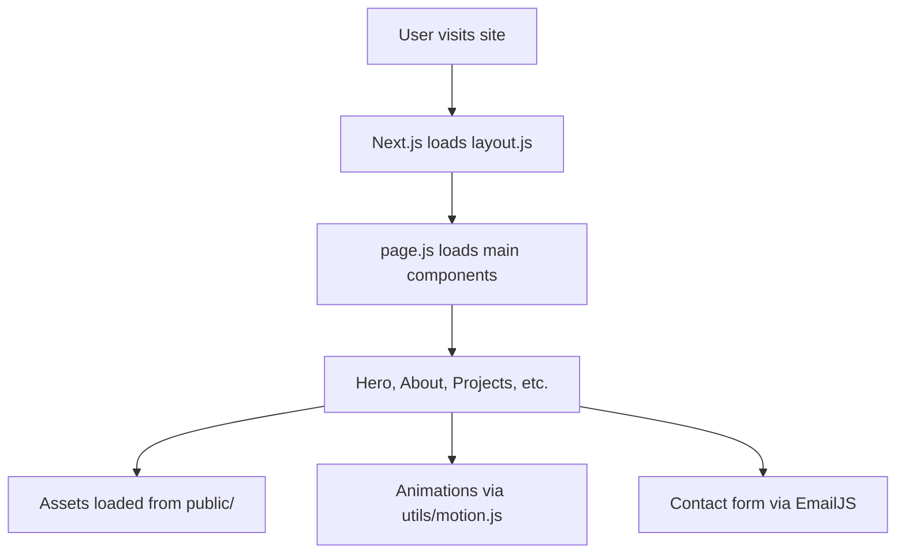

# Deep Documentation: Sagar Portfolio

## Architecture Overview

### Folder Structure
```
Sagar_Portfolio/
├── public/           # Static assets
├── src/
│   ├── app/          # Next.js app directory
│   ├── components/   # UI components
│   ├── constants/    # Static data
│   ├── scripts/      # Utility scripts
│   ├── styles/       # CSS
│   └── utils/        # Helpers
```

### Entry Points
- `next.config.mjs`: Next.js config
- `src/app/layout.js`: Global layout
- `src/app/page.js`: Main page

## Component Inventory

| Component         | Purpose                                      |
|-------------------|----------------------------------------------|
| Hero.js           | Main hero section, intro/profile             |
| About.js          | Personal background/bio                      |
| Projects.js       | Portfolio projects grid                      |
| Tech.jsx          | Tech stack icons                             |
| CustomCursor.js   | Custom animated cursor                       |
| Loader.jsx        | Loading animation                            |
| Navigation.js     | Site navigation                              |
| Contact.js        | Contact form                                 |
| Experience.js     | Work/education experience                    |
| Skills.js         | Skills display                               |
| canvas/Ball.jsx   | 3D/animated ball                             |
| canvas/BallGrid.jsx| Grid of animated balls                      |

## Workflow Diagram


## Data & State Flow
- Static data from `constants/index.js`
- Props passed to components
- Animations via `utils/motion.js`
- Contact form uses EmailJS (requires env vars)

## WebSocket/API Details
- EmailJS integration in `scripts/setup-emailjs.js` and `Contact.js`
- No WebSocket detected in structure

## Demo Script
1. Open site
2. Show hero section (animated intro)
3. Scroll to About, Experience, Skills
4. Showcase Projects grid
5. Interact with Tech stack icons
6. Show custom cursor and loader
7. Submit contact form (demo EmailJS)

## Environment Variables
- `.env.local` required for EmailJS:
  - `NEXT_PUBLIC_EMAILJS_SERVICE_ID`
  - `NEXT_PUBLIC_EMAILJS_TEMPLATE_ID`
  - `NEXT_PUBLIC_EMAILJS_USER_ID`

## Local Development
```bash
npm install
npm run dev
```

## Deployment
- Vercel: Connect repo, auto-deploy
